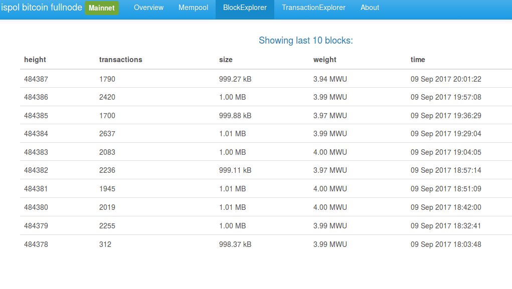

# 01C Node

This is a webfrontend for a full bitcoin node. Bitcoin-core is running as the backend and this little app allows you to see the status of the node through an easy graphical web frontend. 

# demo page
demo page can be found at http://node.chcembitcoin.sk

# Implemented pages:
- overview - shows basic info about the node like processor count, available memorry, active interfaces and connected peers

- mempool - page shows total mempool entries and the last 10 txes in realtime that the bitcoind client sent us through zeromq 

- block explorer - the latest block is shown as a json - no view implemented yet, just the backend interaction 

- transaction explorer - details about a TX are shown once the hash is included in the search bar


# how to setup:
- download bitcoind or bitcoin-qt
- build it with zeromq support (zeromq is needed for the mempool page to work, in case you do not want to see realtime tranasctions this step can be ommited)
- make some extra bitcoin configuration to make the frontend work (note turning on txindex will require to reindex the whole blockchain which takes a lot of time, you were warned :) ):
```
daemon=1
rpcuser=<some user>
rpcpassword=<a very secret password>
server=1
zmqpubhashtx=tcp://127.0.0.1:28332
zmqpubhashblock=tcp://127.0.0.1:28332
zmqpubrawblock=tcp://127.0.0.1:28332
zmqpubrawtx=tcp://127.0.0.1:28332
txindex=1
```
- get this repo via git and edit the file config/default.yaml - the credentials should be the same as in your bitcoin.conf. Also adjust the host and port accordingly
```
RPC:
  host: localhost
  port: 8332
  rpc_username: <some username>
  rpc_password: <a very secret passwor
```
- then install the dependencies:
```
npm install
```
- build the javascript bundle file
```
npm build
```
- and start the web frontend (please note it will run in a console, do not close it or your webserver will quit, still in developement, will be fixed later)
```
node server.js
```
- browse to http://localhost:5000 to view the page (assuming the bitcoin-core and the web frontend are on the same node)

# todos:
- see issues page


# Author
Tomas Kanocz
